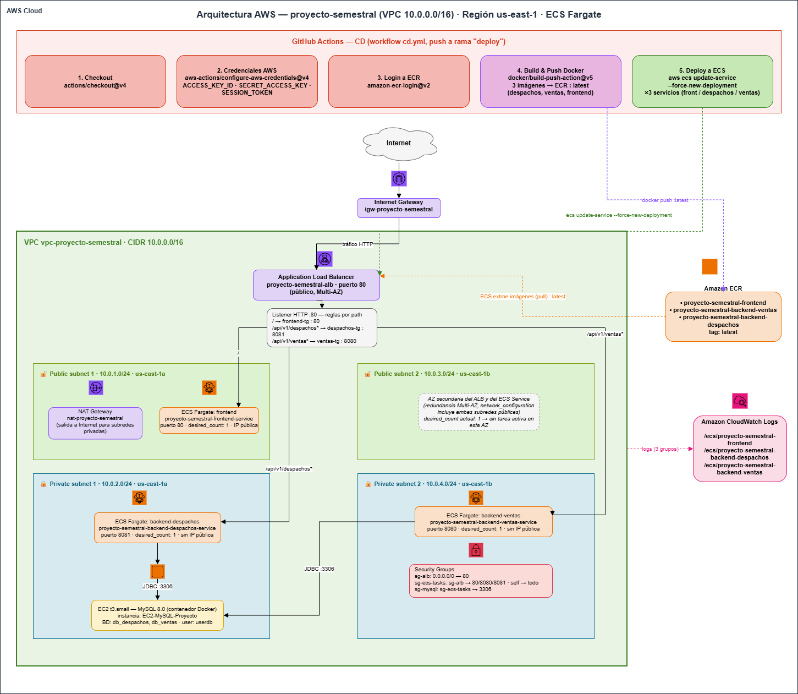

# Sistema de Gestión de Ventas y Despachos: Arquitectura DevOps sobre AWS EKS

## Descripción del Proyecto
Proyecto semestral enfocado en la implementación de una arquitectura de microservicios distribuida y automatizada en AWS. El sistema gestiona de forma desacoplada la lógica de negocio de **Ventas** y **Despachos**, integrando persistencia relacional en MySQL y un frontend interactivo, todo orquestado bajo **Elastic Kubernetes Service (EKS)**.

La solución destaca por su alta disponibilidad, automatización completa mediante integración y entrega continua (CI/CD), e Infraestructura como Código (IaC).

---

## Prácticas DevOps y Arquitectura
Este proyecto cumple con altos estándares operacionales y de infraestructura:

* **Infraestructura Inmutable (IaC):** Todo el ecosistema base de AWS (VPC, Subredes, Internet Gateway y Clúster EKS) es aprovisionado y destruido de forma declarativa y segura utilizando Terraform.
* **Autoescalado Dinámico (HPA):** Implementación de Metrics Server y Horizontal Pod Autoscaler. El clúster escala automáticamente las réplicas de los backends cuando el consumo de CPU supera el 60%.
* **Pipeline CI/CD:** Flujo de trabajo completamente automatizado en GitHub Actions que realiza la compilación (Build), creación de imágenes, subida a AWS ECR (Push) y despliegue directo en Kubernetes, finalizando con un *Health Check* de la nube.
* **Seguridad y Aislamiento:** 
  * Los contenedores backend no exponen puertos públicos (utilizan `ClusterIP`).
  * Tráfico gestionado a través del balanceador de carga público generado por el servicio de Kubernetes (`LoadBalancer`) apuntando únicamente al frontend.
  * InitContainers configurados para garantizar que los backends esperen a que MySQL esté saludable antes de arrancar.

---

## Guía de Despliegue (Cómo usar este proyecto)

### 1. Aprovisionar la Infraestructura (AWS & Terraform)
Configure sus credenciales de AWS CLI y construya los cimientos en la nube:

cd infra
terraform init
terraform apply -auto-approve
Espere a que Terraform finalice la creación de la VPC y el clúster EKS.

### 2. Automatización CI/CD (GitHub Actions)
Asegúrese de tener configurados los siguientes Secrets en su repositorio de GitHub:
AWS_ACCESS_KEY_ID, AWS_SECRET_ACCESS_KEY, AWS_SESSION_TOKEN, DB_USER, DB_PASS.

Al realizar un Merge o Push a las ramas develop, deploy o main, GitHub Actions tomará el control automáticamente:

Compilará las aplicaciones Java.
Construirá las imágenes Docker y las subirá a ECR.
Actualizará el kubeconfig e inyectará el Metrics Server.
Desplegará los manifiestos YAML en EKS.

### 3. Conexión y Monitoreo Local
Para interactuar con el clúster desde su terminal, conecte kubectl con AWS:

aws eks update-kubeconfig --region us-east-1 --name devops3-cluster
Comandos útiles de diagnóstico:
kubectl get pods            # Ver el estado de todos los pods
kubectl get hpa             # Comprobar el funcionamiento del Autoescalado
kubectl get svc frontend-despacho  # Obtener la URL pública del Frontend

### 4. Apagado Seguro (Destrucción)
Para evitar costos y bloqueos en AWS (DependencyViolation), destruya el entorno en este orden exacto:

# Eliminar recursos de Kubernetes (Destruye el LoadBalancer)
kubectl delete -f infra/k8s/

# Destruir la infraestructura base
cd infra
terraform destroy -auto-approve

### Análisis de Rendimiento y Métricas (IE6)
Durante las pruebas de despliegue y estrés, se recopilaron las siguientes métricas clave:

Tiempos de Pipeline (GitHub Actions): El tiempo promedio de despliegue (desde el commit hasta el clúster activo) es de aproximadamente 3 a 6 minutos. El cuello de botella principal detectado es la creación inicial del clúster EKS y la compilación de los ejecutables Java con Maven.

Autoescalado (HPA): Se comprobó la eficiencia del clúster ante el consumo de recursos. Al inyectar tráfico que supera el 60% de uso de CPU base (200m), el clúster escala exitosamente de 2 a 5 réplicas en un lapso de 45 y 90 segundos.

Manejo de Errores y Recuperación:

Se mitigó el riesgo de errores de conexión a base de datos implementando InitContainers.

La inyección dinámica de credenciales mediante Kubernetes Secrets desde GitHub Actions resolvió vulnerabilidades de exposición en los manifiestos YAML.

## Autores

Jose Espinosa

Vicente Garrido

## Profesor
Alan Marcelo Gajardo Medina

Estudiantes Ingeniería en Informática, Duoc UC.